# The Peace of Mind Project: Mental Health Information Website

First individual project with Code institute.

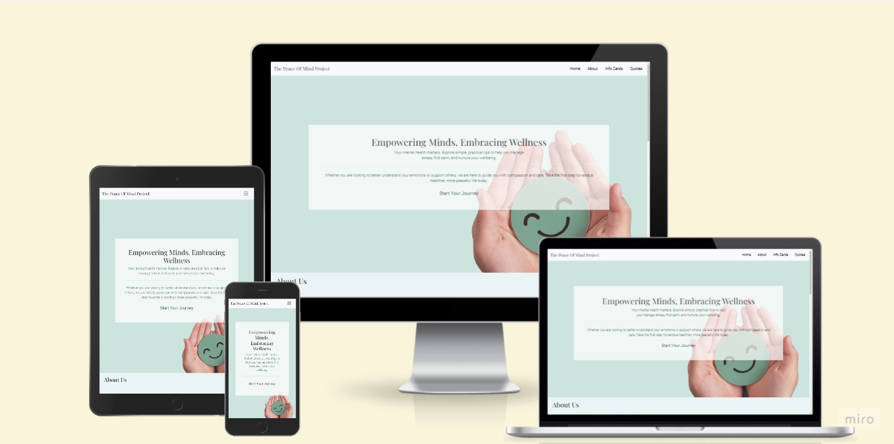

## Description

The Peace of Mind Project is a beginner-friendly website providing accessible information on mental health. It aims to help users recognise common mental health issues and manage stress through a supportive and organised layout.

## Features

- Nav bar with Logo

- Hero section with positive messaging and call to action

- About section

- Information cards on various mental health topics with links provided to external sources for further information.

- Carousel with positive messaging.

- Footer with social media links

## UX
### The Brief

#### External User’s Goal:
The user seeks accessible, beginner-friendly information on mental health, including how to recognize common issues and manage stress, presented in a supportive and organised layout.
#### Site Owner’s Goal:
The site owner wants to create a welcoming webpage that provides basic mental health information using a clean and supportive design. The focus is on using HTML and CSS with Bootstrap to create a calming and well-organised user experience.

Project planned on Miro - [My Miro Board](https://miro.com/app/board/uXjVLaOiO7s=/?share_link_id=282470269171)

### Inital design thoughts

As this website is for mental health awareness, I wanted to create a simple flowing webpage that brought a calming experience to the user with out being overloading to the user. I felt the colour pallette used was extremely important as it sets the tone of the webpage

#### Colour pallet

I wanted to use a colour pallette that kept inline with the clean and supportive experience. For that reason I wanted to use a green pallette as that often promote the feelings of renewal, tranquility, growth, and inspiration.

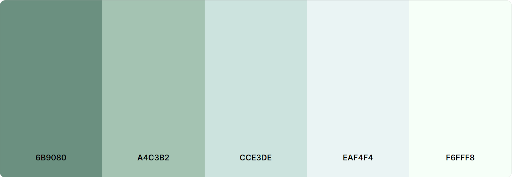
#### Typography

Playfair Display - used for headers as its a stylish serif font that aligns with my concepts of bring a calming experience to the user.

Roboto - used for main bodies of text as it is simple and highly readable emphasising the ease of use. 

Font awesome for any icons used.

### User Stories

- <b>As a user</b>, I want the information on the website to be presented in a simple, beginner-friendly format, so I can learn without feeling overwhelmed.

- <b>As a user</b>, I want mobile-friendly access to the website, so I can browse on any device comfortably.

- <b>As a user</b>, I want the website to be well-organized with clear navigation, so I can find the information I need without confusion.

- <b>As the site owner</b>, I want the site layout to be clean and uncluttered, so users can easily navigate and absorb the information without distraction.

- <b>As the site owner</b>, I want to include resources and external links, so users can seek further help if needed.

- <b>As the site owner</b>, I want to include visuals and calming colours, so the design supports the mental well-being theme of the site.

### User stories Reflections

#### Must haves
 - Beginner-Friendly Information
 - Mobile-Friendly Access
 - Well-Organised Navigation

 #### Should have
 - Visuals and Calming Colors
 - Clean and Uncluttered Layout

#### Could have
- Resources and External Links

# Wireframe & Initial Design

- <b>Page 1</b>: Contains nav bar jumbotron with call to action button. Responsive nav bar for mobile devices. About section.
- <b>Page 2</b>: Contains information cards and images.
- <b>Page 3</b>: Contains external links, a carousel containing positive messaging and a footer with links to socials.

### Mobile
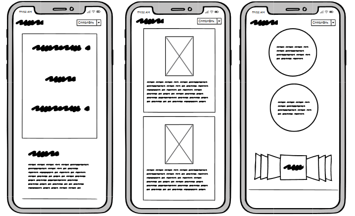

### Tablet
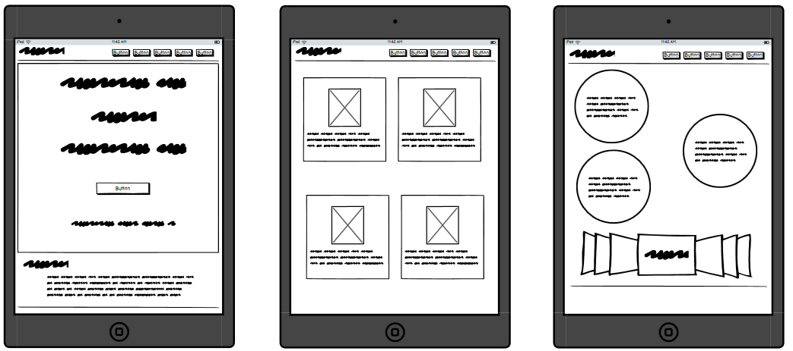

### Desktop
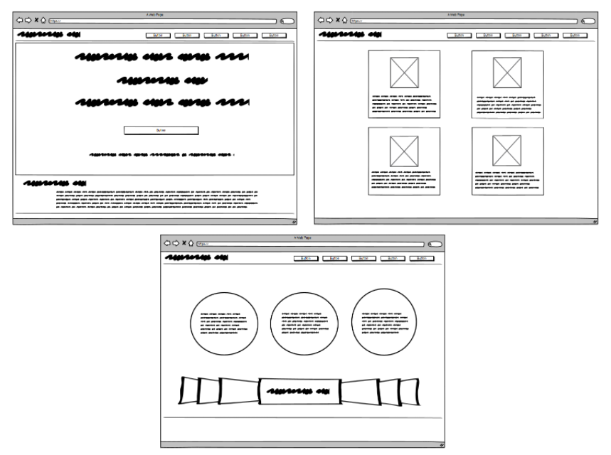

### Inital Concepts
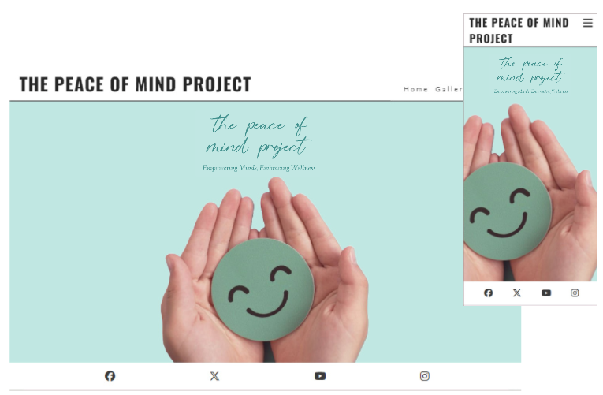

## Technologies Used

- HTML5

- CSS3

- Bootstrap 5

- Gitpod - cloud IDE

## Testing:

[Accessability checker](https://www.accessibilitychecker.org/)

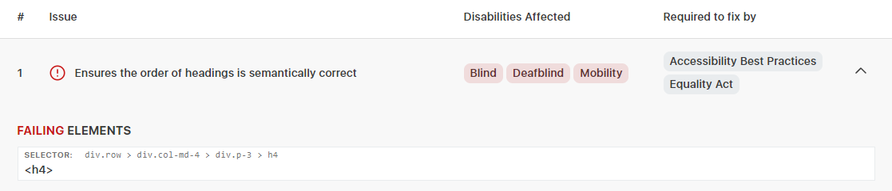

Fix - About Us section heading changed to h3

[W3C Validator](https://validator.w3.org/) 

index.html 

"Error: Attribute section-heading not allowed on element h2 at this point."
From line 86, column 25; to line 86, column 44

Fix - class attribute added.

"Warning: Section lacks heading. Consider using h2-h6 elements to add identifying headings to all sections, or else use a div element instead for any cases where no heading is needed."
From line 255, column 9; to line 255, column 54

Ignored as headings not needed in carousel.

style.css

Error: display: absolute is not a display value.
From line 150, column 14; to line 150, column 21

Fix - removed

### Lighthouse

I ran both mobile devices and desktop through lighthouse to check for any major issues, results as follows:

#### Desktop
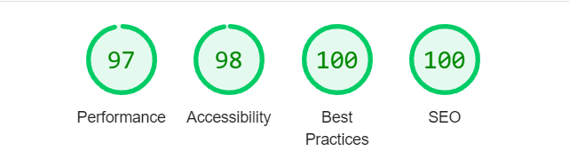

#### Mobile Devices

### Feature Testing

Whilst testing all the features, I noticed that the social links where not working.

Fix - links added to href.

### User Stories

| User Stories  | Website Feature | Reflections |
|---------------|---------------|---------------|
| Beginner-Friendly Information | Small sippets of digestible information displayed in cards, with straightforward language used | To enhance this further in future I would consider breaking down the topics with bullet points offering clear snapshots of information.
| Mobile-Friendly Access | Mobile first design followed, responsive design elements used with media quires and bootstrap classes | Achieved, although please see below in regards to the nav bar.
| Well-Organised Navigation | Clear Navigation displayed at the top of the page and footer contains easy navigation to social links. Links working taking user to relevant sections of the page and external sites | Nav bar is clear and accessible, however the nav bar is currently fixed at the top for mobile devices. This is something I would adjust in further releases to remove the fix when used on smaller devices.
| Visuals and Calming Colors | Simple colour pallette used with  tones of greens contrasting with dark font colouring to ensure accessibility whilst also creating a claming user experience | I feel this was successfully achieved through my simple colour pallette mainly focusing on one colour.
| Clean and Uncluttered Layout | Minimalist design followed with clear sections for the user defined with colours | If I were to add more info to The Peace Of Mind Project, I would consider adding further pages to keep each page clean and uncluttered really focusing on the supportive and organised layout I wanted to achieve.
| Resources and External Links | Cards used have clear buttons taking users to websites | Including the links in the info cards gives the user clear direction of what the links are used for. In future releases I would consider adding an additional page for links along as there is lots of useful information that will help users.

#### Beginner-Friendly Information

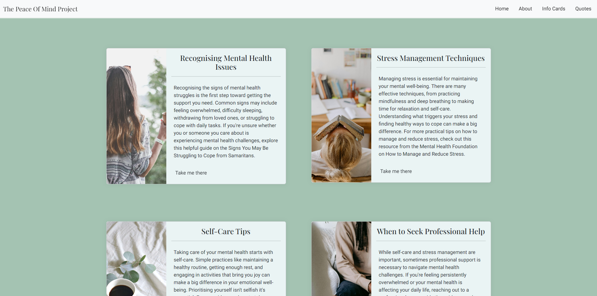

#### Mobile-Friendly Access

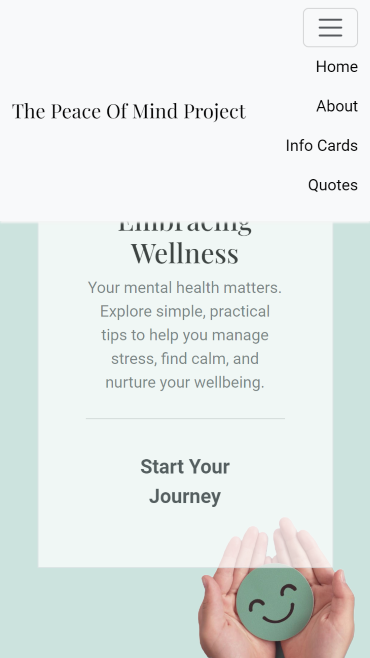 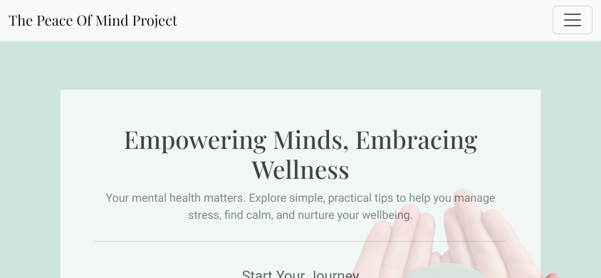

#### Well-Organised Navigation

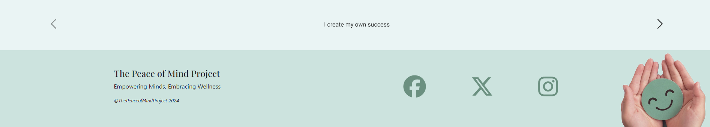

#### Visuals and Calming Colors & Clean and Uncluttered Layout

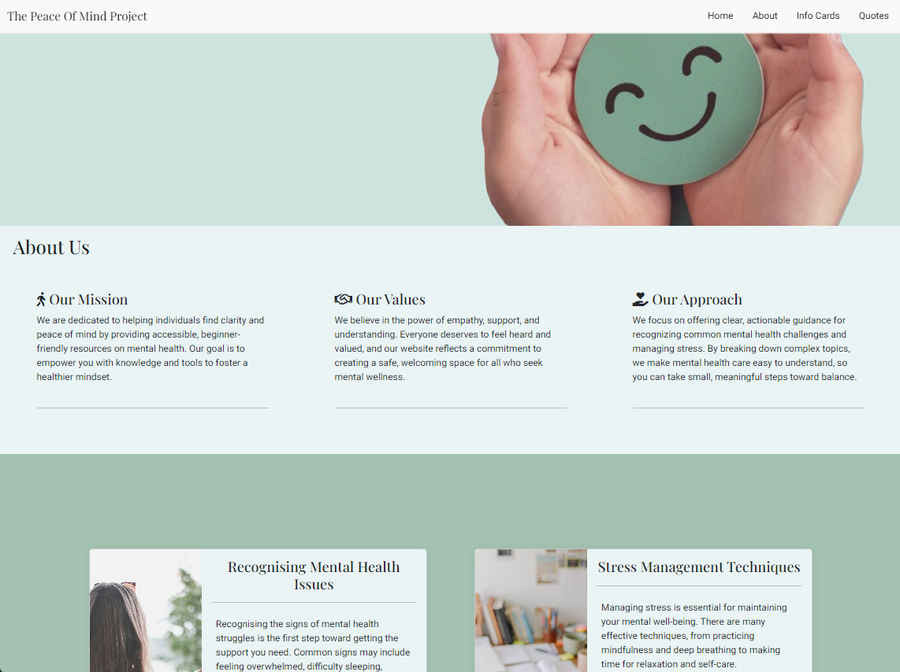

#### Resources and External Links

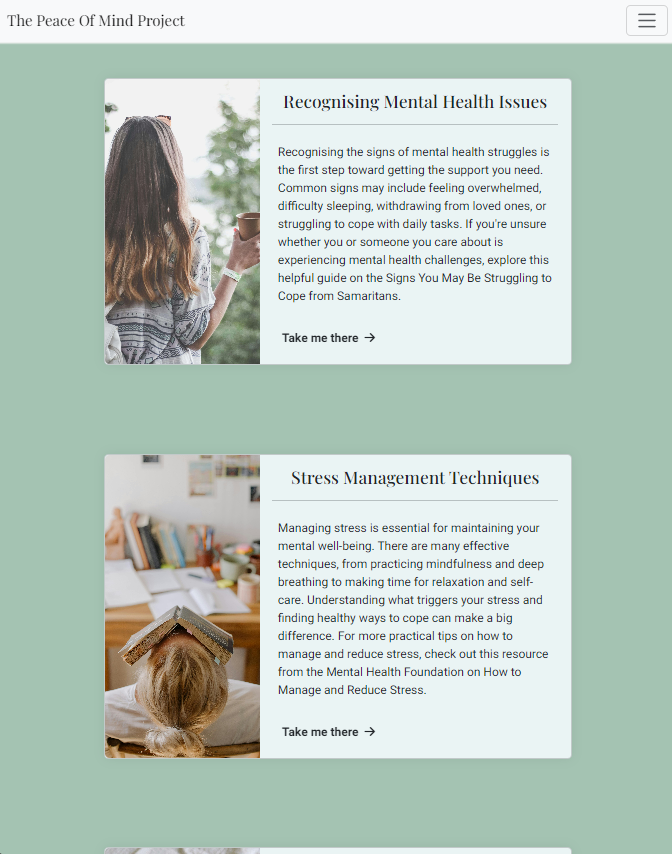

## Deployment

Main branch deployed using GitHub Pages. 

No challenges faced during deployment, appeared and functioned as expected.

## Reflection on Development Process

### Successes
- <b>Responsive Design</b>: Successfully implemented a responsive layout using Bootstrap, ensuring the website is accessible on various devices.
- <b>Content Organisation</b>: Effectively used Bootstrap cards to present mental health information in a clear and organised way.
- <b>Colour Scheme</b>: Created a calming and supportive atmosphere through a well-chosen colour palette, contributing to the overall user experience.

### Challenges
- <b>Bootstrap Customisation</b>: While Bootstrap provided a great starting point, customising it to fit the specific needs of my design goals required some additional learning, experimentation and troubleshooting support.
- <b>Scope and time management</b>: Keeping focused on creating creating a MVP proved tricky at times, I felt I spent too long working on small details which often put me off track of sprit goals I had set with in time limits.

### Final Thoughts

Developing this mental health information website has been a huge learning experience. It gave me hands-on practice with HTML, CSS, and Bootstrap, whilst also highlighting the importance of user-centered design.
The project reinforced the significance of planning and wireframing before diving into coding especially when time constrains are added. It also showed me areas that I did and did not understand in HTML, CSS, and Bootstrap which has been a great learning experience. 

My main take away is the enjoyment I had creating this website, of course there are areas to improve and work upon, but it has deepened my want to learn and explore more in font and back end development.

## Credit

- AI used to assist with text for content generation and user stories. [Chat GPT](https://chatgpt.com/) & [Claude](https://claude.ai/)

- Font awesome used for any icons present and fonts used from google fonts

- Images used from [Pexels](https://www.pexels.com/)

- Inspiration for some elements take from [Code Institute](https://codeinstitute.net/) walkthrough projects, such as [Love-Running](https://github.com/ZASamm/love-running) and [Love-Rosie](https://github.com/ZASamm/love-Rosie)

- Troubleshooting through Code Institutes Slack channels and Coding Coach and fellow students enrolled on the Bootcamp
