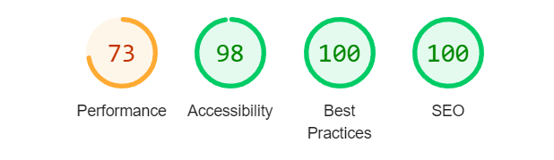

# The Peace of Mind Project: Mental Health Information Website

First individual project with Code institute.

### The Breif

#### External User’s Goal:
The user seeks accessible, beginner-friendly information on mental health, including how to recognize common issues and manage stress, presented in a supportive and organised layout.
#### Site Owner’s Goal:
The site owner wants to create a welcoming webpage that provides basic mental health information using a clean and supportive design. The focus is on using HTML and CSS with Bootstrap to create a calming and well-organised user experience.

## Description

The Peace of Mind Project is a beginner-friendly website providing accessible information on mental health. It aims to help users recognise common mental health issues and manage stress through a supportive and organised layout.

## Features

- Nav bar with Logo

- Hero section with positive messaging

- About section

- Information cards on various mental health topics with links provided to external sources for further information.

- Carousel with positive messaging.

- Footer with social media links

## UX

Project planned on Miro - [My Miro Board](https://miro.com/app/board/uXjVLaOiO7s=/?share_link_id=282470269171)

### Inital design thoughts

As this website is for mental health awareness, I wanted to create a simple flowing webpage that was brought a calming experience to the user with out being overloading to the user. I felt the colour plate used was extremely important as it sets the tone of the webpage

#### Colour pallet

I wanted to use a colour pallette that kept inline with the clean and supportive experience. For that reason I wanted to use a green pallette as that often promote the feelings of renewal, tranquility, growth, and inspiration.

#### Typography

Playfair Display - used for headers as its a stylish serif font that aligns with my concepts of bring a calming experience to the user.

Roboto - used for main bodies of text as it is simple and highly readable emphasising the ease of use. 

Font awesome for any icons used.

### User Stories

- <b>As a user</b>, I want the information on the website to be presented in a simple, beginner-friendly format, so I can learn without feeling overwhelmed.

- <b>As a user</b>, I want mobile-friendly access to the website, so I can browse on any device comfortably.

- <b>As a user</b>, I want the website to be well-organized with clear navigation, so I can find the information I need without confusion.

- <b>As the site owner</b>, I want the site layout to be clean and uncluttered, so users can easily navigate and absorb the information without distraction.

- <b>As the site owner</b>, I want to include resources and external links, so users can seek further help if needed.

- <b>As the site owner</b>, I want to include visuals and calming colours, so the design supports the mental well-being theme of the site.

# Wireframe & Initial Design

### Mobile

### Tablet

### Desktop

### Inital Concepts

## Technologies Used

- HTML5

- CSS3

- Bootstrap 5

- Gitpod - cloud IDE

## Testing:

[W3C Validator](https://validator.w3.org/) 

Round 1:

index.html 

"Error: Attribute section-heading not allowed on element h2 at this point."
From line 86, column 25; to line 86, column 44

Fix - class attribute added.

"Warning: Section lacks heading. Consider using h2-h6 elements to add identifying headings to all sections, or else use a div element instead for any cases where no heading is needed."
From line 255, column 9; to line 255, column 54

Ignored as headings not needed in carousel.

style.css

Error: display: absolute is not a display value.
From line 150, column 14; to line 150, column 21

Fix - removed

### Lighthouse

I ran both mobile devices and desktop through lighthouse to check for any major issues, results as follows:

#### Desktop

#### Mobile Devices

#### Feature test

Whilst testing all the features, I noticed that the social links where not working.

Fix - links added to href.

### User Stories

Reflections on user stories, and areas of  my page I felt meet the criteria:

## Reflections

## Credit

- AI used to assist with text for content generation and user stories. [Chat GPT](https://chatgpt.com/) & [Claude](https://claude.ai/)

- Font awesome used for any icons present and fonts used from google fonts

- Images used from [Pexels](https://www.pexels.com/)

- Inspiration for some elements take from [Code Institute](https://codeinstitute.net/) walkthrough projects, such as [Love-Running](https://github.com/ZASamm/love-running) and [Love-Rosie](https://github.com/ZASamm/love-Rosie)

- Troubleshooting through Code Institutes Slack channels and Coding Coach and fellow students enrolled on the Bootcamp